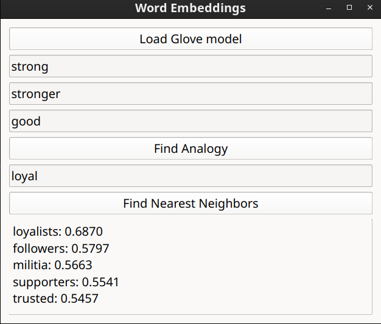
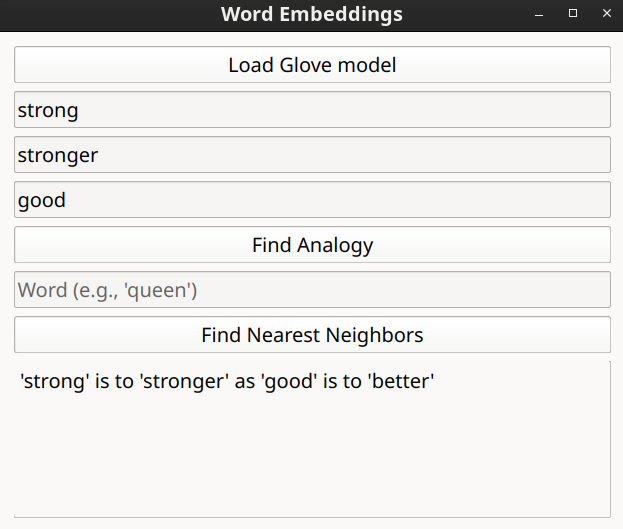
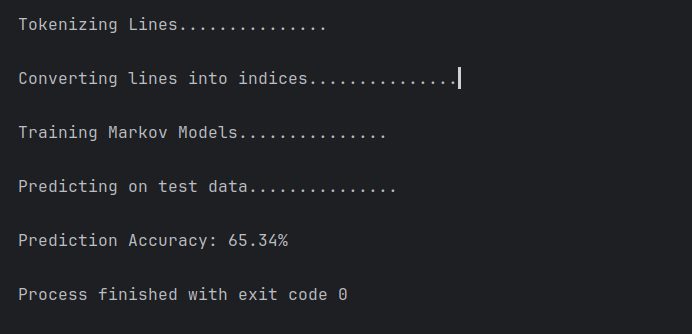
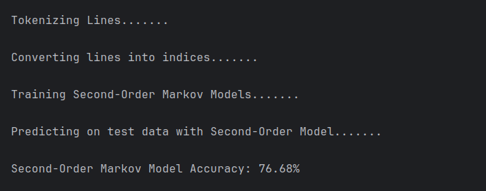
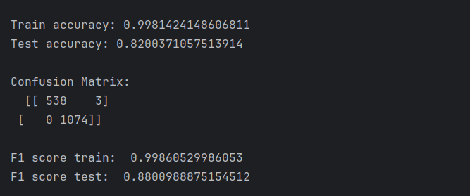
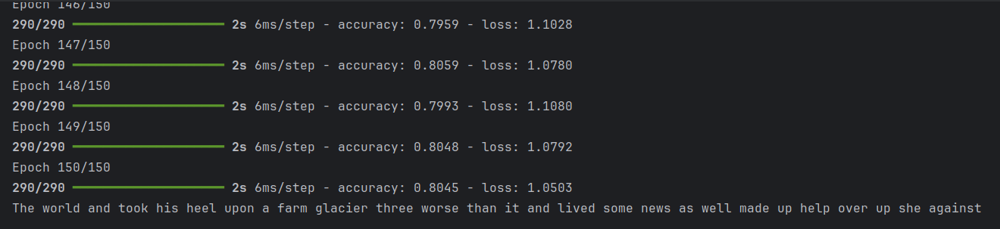
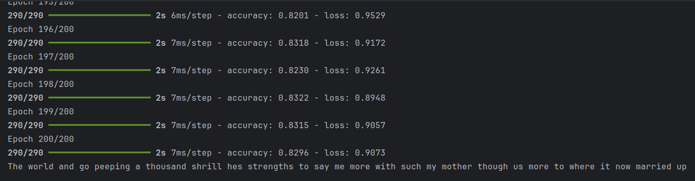

# Natural-Language-Processing-Applications

Repository contains implementations of various Natural Language Processing (NLP) algorithms and applications. It includes fundamental techniques such as tokenization, vectorization, TF-IDF, word embeddings, and advanced deep learning models for text classification, sentiment analysis, named entity recognition (NER), machine translation, and more.
 

# Word Embeddings
Find analogies and neighbor words of a given word using your own or provided word embeddings text file.

### Neighbors

### Analogies

# Probabilistic Models

## HMM - Poetry Classifier
This program uses hidden markov models to distinguish between given two authors'
poetries from each other with the accuracy of ~65%, output of the program should look like
this. To improve consider using bigrams or trigrams instead of just single-word transitions.

For instance, using a second order markov model has increased accuracy up to 77% with a slight changes
in the implementation as shown in the below image.

## Markov Model Text Classifier (same as above,different approach)
A better accuracy with a different implementation taken from Lazy Programmer.

## LSTM Based Poetry Generator
A lstm based generated, based on input training text, as shown
in the picture, program completes the remaining part. 

The model is trained on
150 epoch results around ~78%.

200 epoch results around ~90%

## Datasets & Models
As for datasets of the program,

-GoogleNews-vectors-negative300.bin        
-glove.6B.300d.txt

is used and can be found from the following links.

Glove Embeddings: https://github.com/stanfordnlp/GloVe

Google News: https://www.kaggle.com/datasets/leadbest/googlenewsvectorsnegative300

Edgar Allan Poe Poetries: https://raw.githubusercontent.com/lazyprogrammer/machine_learning_examples/master/hmm_class/edgar_allan_poe.txt

Robert Frost Poetries:  https://raw.githubusercontent.com/lazyprogrammer/machine_learning_examples/master/hmm_class/robert_frost.txt