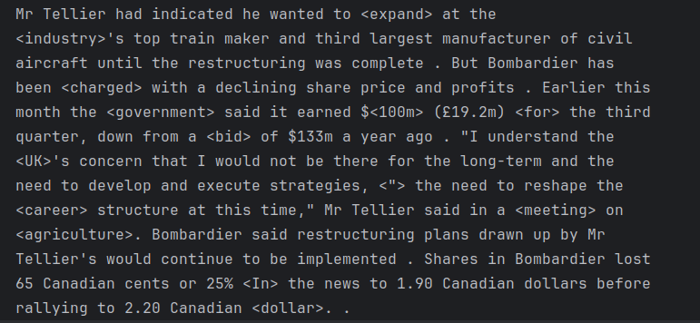

# Natural-Language-Processing-Applications

 
Repository contains implementations of various Natural Language Processing (NLP) algorithms and applications. It includes fundamental techniques such as tokenization, vectorization, TF-IDF, word embeddings, and advanced deep learning models for text classification, sentiment analysis, named entity recognition (NER), machine translation, and more.
 

# Word Embeddings
Find analogies and neighbor words of a given word using your own or provided word embeddings text file.

### Neighbors


### Analogies


# Probabilistic Models

## HMM - Poetry Classifier
This program uses hidden markov models to distinguish between given two authors'
poetries from each other with the accuracy of ~65%, output of the program should look like
this. To improve consider using bigrams or trigrams instead of just single-word transitions.


For instance, using a second order markov model has increased accuracy up to 77% with a slight changes
in the implementation as shown in the below image.


## Markov Model Text Classifier (same as above,different approach)
A better accuracy with a different implementation taken from Lazy Programmer.


## LSTM Based Poetry Generator
A lstm based generated, based on input training text, as shown
in the picture, program completes the remaining part. 

The model is trained on
150 epoch results around ~78%.


200 epoch results around ~90%


## Basic Article Spinner
The spinner works as observing how 3 words act together based on the middle word to 
change it with its synonym to rephrase/spin the article or a given text.



## Sentiment Analysis
App performs sentiment analysis on feedback records from an airline.csv dataset using a Tf-Idf vectorizer to convert text into numerical features and a Logistic Regression model for classification. 
Initially, it handled three sentiment classes: positive, negative, and neutral. 
The code then transitions to a binary classification task by focusing only on positive and negative feedback. 
It evaluates the model's performance using accuracy and AUC scores and visualizes the results using confusion matrices. 
Furthermore, the script extracts and displays the words that the model most strongly associates with positive and negative sentiment based on the learned weights. 
App also includes a section outlining potential future exercises, such as identifying the most misclassified tweets and exploring the impact of class weighting. 
The current implementation focuses on airline feedback records dataset, it can be adapted for similar sentiment analysis tasks. 
Adding more classes and adjusting thresholds are suggested areas for future improvement.

### Class Distribution


### Heatmap


### Learnt best positive words


## Datasets & Models
As for datasets of the program,

-GoogleNews-vectors-negative300.bin        
-glove.6B.300d.txt

is used and can be found from the following links.
To get the datasets into your colab environment use,

```bash
!wget <your_desired_url> 
```

Example usage:
```bash
!wget -nc https://lazyprogrammer.me/course_files/nlp/bbc_text_cls.csv
```

Glove Embeddings: https://github.com/stanfordnlp/GloVe

Google News: https://www.kaggle.com/datasets/leadbest/googlenewsvectorsnegative300

Edgar Allan Poe Poetries: https://raw.githubusercontent.com/lazyprogrammer/machine_learning_examples/master/hmm_class/edgar_allan_poe.txt

Robert Frost Poetries:  https://raw.githubusercontent.com/lazyprogrammer/machine_learning_examples/master/hmm_class/robert_frost.txt

BBC News & Articles (alternative): https://www.kaggle.com/datasets/hgultekin/bbcnewsarchive/data